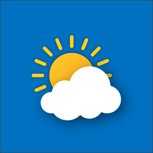

Recorded weather using Raspberry Pi sensors, stored values in a cloud-based database. Computed averages, low and high temperatures using C and SQL. It captured weather data for three days and the data was useable by weather companies. I learned how to do database programming and using Raspberry Pi sensors. 

From doing this project I learned that you can do a lot with raspberryPI and how versatile it is. I learned how to hook sensors to a raspberryPI to read temperature and to print out words to a screen. This was my first time doing database programming so learning how to do that was different and fun. I can transfer this knowledge to jobs because manying jobs use databases in some ways to store data.  

